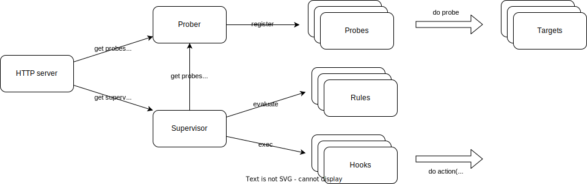

# HealthSupervisor

HealthSupervisor is a robust health monitoring and aggregation system designed to supervise and report on the overall health status of complex, distributed systems. It aggregates health information from various services, components, and even other HealthSupervisor instances to provide a comprehensive view of your system's status.

## Overview

HealthSupervisor uses a combination of probes, rules, and hooks to monitor and manage the health of your system. It provides a flexible and extensible framework for defining health checks, aggregating results, and automating responses based on the overall system status.

Key features:

- Aggregates health statuses from multiple services and components
- Provides a single endpoint for querying the overall system health
- Allows for custom weighting and importance of individual service health checks
- Supports complex rules for determining the aggregate health status
- Enables automated actions through hooks based on health status changes
- Can evaluate the status of other HealthSupervisor instances, enabling multi-cluster health monitoring

HealthSupervisor acts as a versatile health aggregator, allowing you to:

1. Monitor the health of individual services and components
2. Define rules for how these individual health statuses contribute to the overall system health
3. Get a unified view of your system's health through a single API endpoint
4. Trigger automated responses based on changes in the aggregate health status
5. Incorporate the health status of other HealthSupervisor instances into its own health evaluation

Multi-Cluster Support:
HealthSupervisor can be configured to monitor and evaluate the status of other HealthSupervisor instances. This feature is particularly useful in multi-cluster or multi-region architectures. Each HealthSupervisor can:

- Monitor services within its own cluster or region
- Evaluate the status of other HealthSupervisor instances in different clusters or regions
- Incorporate these external statuses into its own health calculation

This approach allows for flexible and interconnected health monitoring across complex, geographically distributed systems. Each HealthSupervisor instance can have its own unique configuration, taking into account both local services and the status of remote HealthSupervisors to determine its overall health status.

This makes HealthSupervisor an invaluable tool for maintaining high availability, quick problem detection, and automated incident response in complex, microservices-based architectures.

## Architecture



The HealthSupervisor system consists of the following main components:

1. **Prober**: Manages and executes various probes to check the health of different components.
2. **Supervisor**: Evaluates the overall health status based on probe results and defined rules.
3. **HTTP Server**: Provides an API endpoint for querying the current health status.
4. **Rules**: Define the criteria for determining the overall health status.
5. **Hooks**: Allow for automated actions based on health status changes.

## Getting Started

HealthSupervisor can be deployed to Kubernetes using the provided Helm chart. This section describes how to deploy the application using Helm.

### Prerequisites

- Kubernetes cluster
- Helm 3.x installed
- `kubectl` configured to communicate with your cluster

### Deploying with Helm

1. Navigate to the project root directory:
   ```bash
   cd healthsupervisor
   ```

2. Update the `values.yaml` file in the `chart` directory to configure your deployment. You can also create a custom values file (e.g., `my-values.yaml`) to override default values.

3. Install the HealthSupervisor chart:
   ```bash
   helm install healthsupervisor ./chart -f values/local.yaml
   ```
   
   This command uses the values from `values/local.yaml`. You can specify a different values file or override specific values:
   ```bash
   helm install healthsupervisor ./chart -f my-values.yaml --set image.tag=v1.0.0
   ```

4. Check the status of the deployment:
   ```bash
   kubectl get pods -l app.kubernetes.io/name=healthsupervisor
   ```

5. To access the HealthSupervisor API, you can use port-forwarding:
   ```bash
   kubectl port-forward svc/healthsupervisor 8080:80
   ```
   Then access the health endpoint at `http://localhost:8080/health`


## Configuration

HealthSupervisor is highly configurable through a YAML file. Here's an overview of the main configuration sections:

### Probes

Probes are used to check the health of individual services or components. Each probe has the following properties:

- `name`: A unique identifier for the probe
- `kind`: The type of probe (e.g., "http", "remoteSupervisor")
- `target`: The URL or endpoint to check
- `interval`: How often to run the probe (in seconds)
- `weight`: The importance of this probe in the overall health calculation (optional)
- `expectedStatusCode`: For HTTP probes, the expected HTTP status code (optional)

Example:
```yaml
probes:
  - name: "http-probe"
    kind: "http"
    target: "http://example.com"
    interval: 30
    weight: 1
    expectedStatusCode: 200
```


### Rules

Rules define how the results of probes are evaluated to determine the overall health status. Each rule has:

- `name`: A unique identifier for the rule
- `kind`: The type of rule (e.g., "healthy", "remoteSupervisorEvaluation")
- `probes`: An array of probe names this rule applies to
- `ifnot`: Conditions that, if not met, trigger the rule

Example:
```yaml
rules:
  - name: "http-probe-rule"
    kind: "healthy"
    probes: ["http-probe"]
    ifnot:
      - http-probe: false
```


### Hooks

Hooks allow you to define actions that should be taken based on certain conditions. Each hook has:

- `name`: A unique identifier for the hook
- `conditions`: The conditions that trigger the hook
- `actions`: The actions to perform when the conditions are met

Example:
```yaml
hooks:
  - name: "http-probe-hook"
    conditions:
      - http-probe: false
    actions:
      - name: "http-probe-action"
        kind: "http"
        url: "http://example.com"
```

## Development

This section covers the setup for local development of HealthSupervisor.

### Prerequisites

- Docker
- Kubernetes cluster (e.g., local Kind cluster)
- DevSpace
- Go 1.20 or later

### Development with DevSpace

```bash
devspace dev
```
